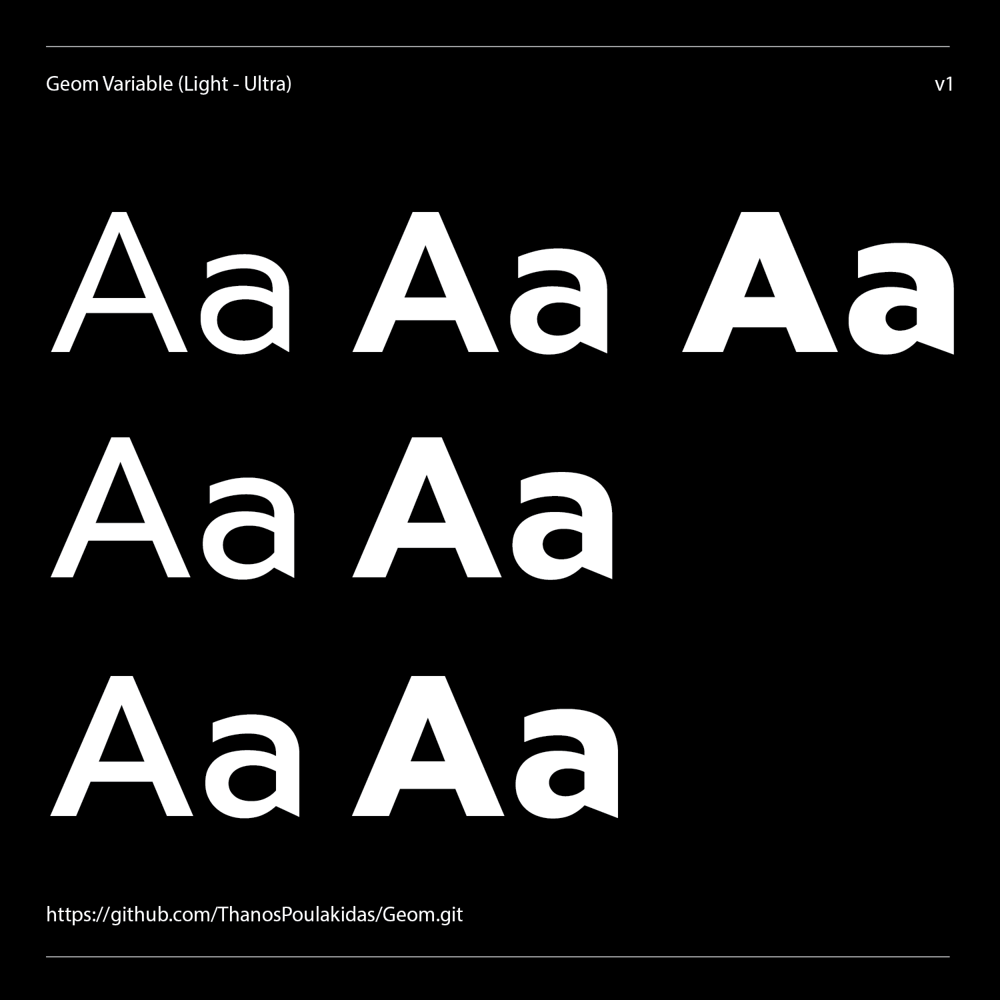

# GEOM

  

[![][Fontbakery]](https://ThanosPoulakidas.github.io/Geom/fontbakery/fontbakery-report.html)

[![][Universal]](https://ThanosPoulakidas.github.io/Geom/fontbakery/fontbakery-report.html)

[![][GF Profile]](https://ThanosPoulakidas.github.io/Geom/fontbakery/fontbakery-report.html)

[![][Outline Correctness]](https://ThanosPoulakidas.github.io/Geom/fontbakery/fontbakery-report.html)

[![][Shaping]](https://ThanosPoulakidas.github.io/Geom/fontbakery/fontbakery-report.html)

  

[Fontbakery]: https://img.shields.io/endpoint?url=https%3A%2F%2Fraw.githubusercontent.com%2FThanosPoulakidas%2FGeom%2Fgh-pages%2Fbadges%2Foverall.json

[GF Profile]: https://img.shields.io/endpoint?url=https%3A%2F%2Fraw.githubusercontent.com%2FThanosPoulakidas%2FGeom%2Fgh-pages%2Fbadges%2FGoogleFonts.json

[Outline Correctness]: https://img.shields.io/endpoint?url=https%3A%2F%2Fraw.githubusercontent.com%2FThanosPoulakidas%2FGeom%2Fgh-pages%2Fbadges%2FOutlineCorrectnessChecks.json

[Shaping]: https://img.shields.io/endpoint?url=https%3A%2F%2Fraw.githubusercontent.com%2FThanosPoulakidas%2FGeom%2Fgh-pages%2Fbadges%2FShapingChecks.json

[Universal]: https://img.shields.io/endpoint?url=https%3A%2F%2Fraw.githubusercontent.com%2FThanosPoulakidas%2FGeom%2Fgh-pages%2Fbadges%2FUniversal.json

  

Geom is a contemporary geometric sans-serif typeface designed with a balance between precision and expressiveness. While it draws inspiration from the classic geometric tradition, it introduces subtle dynamic elements that bring rhythm and energy to the letterforms. These details make Geom more than a strictly geometric construction — they lend it character and movement, setting it apart from similar typefaces.

Geom comes in seven weights, ranging from Light to Black, each with its own carefully adjusted proportions to maintain consistency and readability across the entire family. True italics accompany every upright weight, extending the typeface’s versatility and allowing for clear typographic hierarchy and emphasis. The typeface is also available as a variable font, providing designers with seamless control over weight transitions.

Although Geom was conceived primarily for display purposes — in titles, branding, and large headlines — it performs equally well in smaller text sizes. Its geometric clarity ensures excellent legibility, while its subtle deviations from pure geometry make it visually engaging even in extended reading.

By combining geometric precision with refined dynamism, Geom stands as a contemporary sans-serif that balances structure and liveliness — a typeface that feels both timeless and distinctly modern.
  

## Variable Axes

Geom has the following axes:

  
- Weight (wght) - 300 to 900. (Default 400) Controls the darkness of the composed text.
  

## Building

  

Fonts are built automatically by GitHub Actions - take a look in the "Actions" tab for the latest build.

  

If you want to build fonts manually on your own computer:

  

*  `make build` will produce font files.

*  `make test` will run [FontBakery](https://github.com/googlefonts/fontbakery)'s quality assurance tests.

*  `make proof` will generate HTML proof files.

  

The proof files and QA tests are also available automatically via GitHub Actions - look at https://ThanosPoulakidas.github.io/Geom.

  

## Changelog

  

When you update your font (new version or new release), please report all notable changes here, with a date.

[Font Versioning](https://github.com/googlefonts/gf-docs/tree/main/Spec#font-versioning) is based on semver.

Changelog example:

  

**26 May 2021. Version 2.13**

- MAJOR Font turned to a variable font.

- SIGNIFICANT New Stylistic sets added.

  

## License

  

This Font Software is licensed under the SIL Open Font License, Version 1.1.

This license is available with a FAQ at

https://scripts.sil.org/OFL

  

## Repository Layout

  

This font repository structure is inspired by [Unified Font Repository v0.3](https://github.com/unified-font-repository/Unified-Font-Repository), modified for the Google Fonts workflow.
